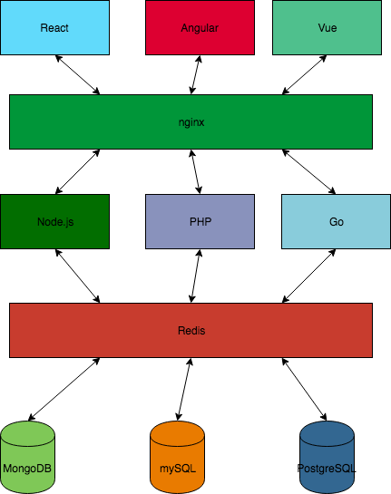

# triple-stack

## Background
This project is a skunkworks project for me to practice building the same basic application in three different stacks:

1. React+Mobx/Node+Express/MongoDB
2. Angular+ngrx/PHP+Laravel/MySQL
3. Vue+vuex/Go+Gin/PostgreSQL

In addition, I will leverage some common technologies across all three stacks:
* Docker
* Redis
* Nginx

Administrative UIs:
* Redis-Commander
* Mongo-Express
* pgAdmin
* phpMyAdmin
* Portainer

Stretch Goals:
* Authentication (JWTs/OAuth)
* Jenkins
* Vagrant
* AWS (S3/EC2)
* GraphQL
* TLS

## Architecture Diagram

## Environment Setup
1. Install Git - https://git-scm.com/downloads 
2. Setup SSH key - https://help.github.com/articles/connecting-to-github-with-ssh/ 
3. Install Docker - https://www.docker.com/get-docker 
4. Install NVM - https://github.com/creationix/nvm#installation
5. Install Node.js via NVM - https://nodejs.org/en/
6. Install PHP - http://php.net/downloads.php 
7. Install Go - https://golang.org/doc/install 
8. Install VSCode - https://code.visualstudio.com/
9. Install VSCode extensions

## Scaffolding
In order to support rapid development, I am taking advantage of the following scaffolding tools/CLIs:
1. Create-React-App - https://github.com/facebook/create-react-app 
2. Angular CLI - https://cli.angular.io/ 
3. Vue CLI - https://github.com/vuejs/vue-cli